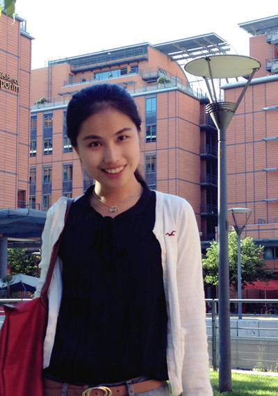

::: {.column style="float:left;  width: 35%;"}
## 

**WEI YANG**

wyang\@ceibs.edu\
86-21-28905637\
699 Hongfeng Road, Pudong\
Shanghai 201206, China

<a href="https://github.com/weiyang873/weiyang873.github.io/blob/main/Wei%20Yang_CV_Nov2022.pdf">CV</a>
:::

::: {.column style="float:right;  width: 65%;padding: 15px;"}
I am an Assistant Professor of Management at China Europe International Business School (CEIBS). My research focuses on corporate strategies and entrepreneurship in high technology settings. I am particularly interested in how firms' knowledge creation is shaped by their surrounding industrial and social contexts, especially by their interactions with rivals, external collaborators, users, investors and the media.

My research examines the dynamics and implications of innovation and technology development, particularly how socially embedded firms' search activities in innovation are jointly shaped by their capabilities, strategies, and interactions with external players, including inter-firm collaborators, knowledge and information intermediaries, and the social and institutional environment. Following those directions, I have published in ***Academy of Management Journal***, ***Strategic Management Journal***, ***Organization Science***.

Drawing on the theories of technology ecosystems, platform competition, and technological changes, my published papers and current research projects center around three innovation-related themes:

1.  Distributed innovation on open platforms and technology ecosystems

2.  External drivers of adaptation to new technologies

3.  Microfoundations of innovation

I received my B. A. in Economics and English Literature and M.S. in Management from Peking University, China. I also hold a Master of Finance degree from the University of Hong Kong.
:::
